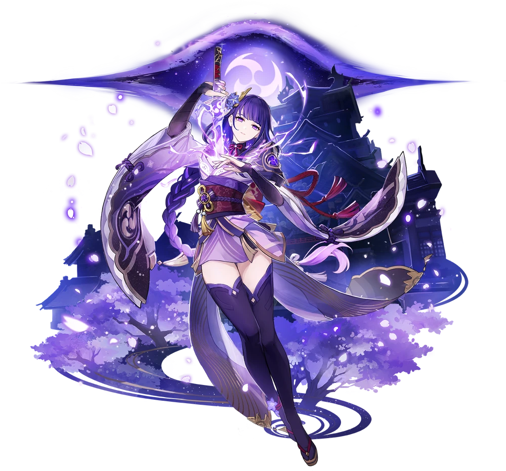

  

  
  
  
  
  

---

<h2 align="center">雷电将军 · 角色档案</h2>

  
  
  
  
  

  

<blockquote>

  <strong>天赋技能</strong>

<table align="center" border="0">
  <tr>
    <td align="right" width="120"><b>追求</b></td>
    <td>以「永恒」之名，编纂不灭的代码</td>
  </tr>
  <tr>
    <td align="right"><b>元素战技</b></td>
    <td><code>sudo rm -rf /</code>（请勿尝试）</td>
  </tr>
  <tr>
    <td align="right"><b>元素爆发</b></td>
    <td><code>git push --force-with-lease</code>（奶香的一刀）</td>
  </tr>
  <tr>
    <td align="right"><b>被动天赋</b></td>
    <td>所有 <code>bug</code> 在雷光中灰飞烟灭</td>
  </tr>
  <tr>
    <td align="right"><b>特殊料理</b></td>
    <td>三界路飨祭（但我不会做饭）</td>
  </tr>
</table>
</blockquote>

「我命十方世界雷鸣平息，愿你今晚得享安睡」

---

<h3 align="center">千手百眼 / 技术共鸣</h3>

  
  
  
  
  
  

  
  
  
  
  
  

  
  
  
  
  

  
  
  
  
  
  

---

<h3 align="center">天守阁 / 数据面板</h3>

  

  

  

---

<h3 align="center">鸣神大社 / 联络方式</h3>

  
  
  

---

  

  「我命十方世界雷鸣平息，愿你今晚得享安睡」
   
  — 雷电将军 · 雷电影

