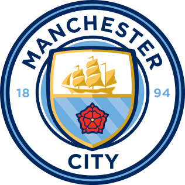

  

  

<h1 align="center">Manchester City Football Club</h1>

  
  
  
  

Blue Moon · 蓝月当空

  

<h3 align="center">荣誉殿堂</h3>

  
  
  
  
  
  

  

<h3 align="center">首发阵容 · 4-3-3</h3>

  

  
  
  

  

  
  
  

  

  
  
  
  

  

  

  

<h3 align="center">替补席</h3>

  
  
  
  

  

<h3 align="center">赛季数据</h3>

  

  

  

  「Come On, City!」
   
  蓝月军团 · Est. 1894

